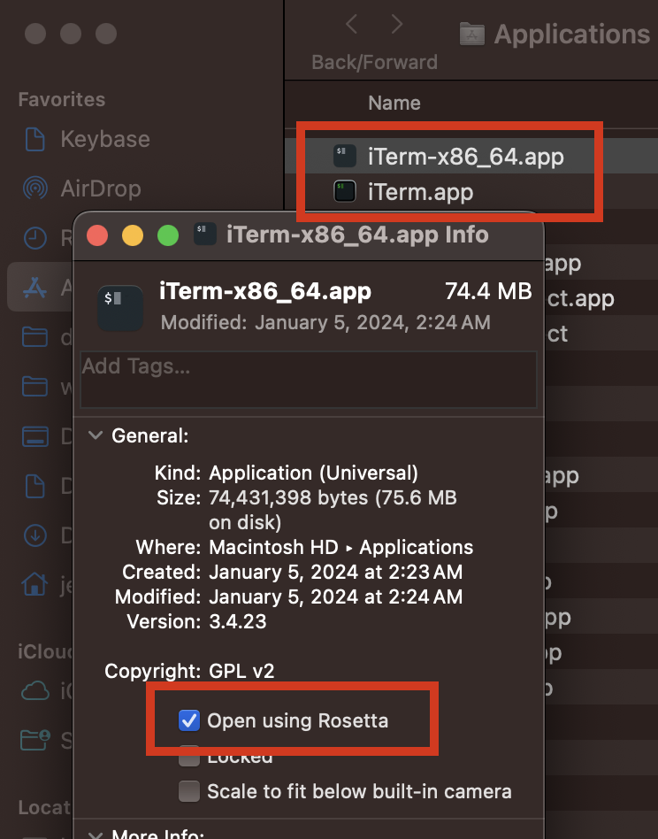
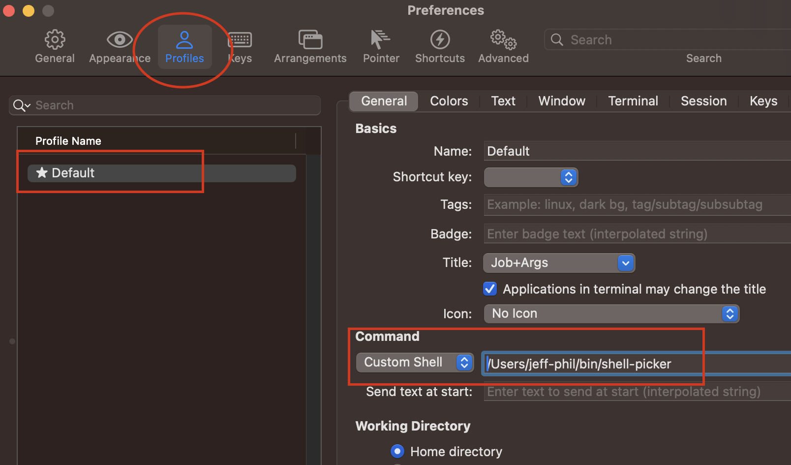

# Shell Picker

## TL;DR
`shell-picker` can be used as a ***Custom Shell*** or start-up ***Command*** for an [iTerm2](https://iterm2.com/) Profile on macOS Apple Silicon to automatically pick the real shell for the desired architecture `arm64` or `x86_64` running in Rosetta 2.

## Full Story
macOS on Apple Silicon currently provides ability to run 2 architectures: `arm64` and (using Rosetta 2) `x86_64` for legacy applications that have not yet migrated to arm64 platform.  This provides a bit of a challenge for development, when the development tools and utilities are not yet converted.

An example use case is [Tableau Hyper API](https://pypi.org/project/tableauhyperapi/), which after many years, [only supports `x86_64`](https://tableau.github.io/hyper-db/docs/installation). While the simplified instructions in the Hyper API installation documentation makes note of running python on Rosetta (`arch -x86_64 /usr/bin/python3 ...`), development would generally require a more than just being able to run python.  Preferably getting a dedicated shell to run `x86_64` and everything else in the tool-chain needed to created and validate (in iTerm2) needs a bit more.

Running in iTerm2 with some of the fancy, and at times helpful, zsh plugins requires some setup that is more easily done with [Homebrew](https://brew.sh/), or other package managers - for both `arm64` and `x86_64`. Out of the box, iTerm2 uses the user's login shell, which by default in macOS is `/bin/zsh`. This build of zsh is a universal app, and works just fine running either out or inside Rosetta.  However, the underlying plugins from `brew` won't work if they are sourced in `x86_64` but for `arm64` causing extra debugging.

The `shell-picker` universal command can be configured and used by iTerm2 as the `Custom Shell` which is a Profile setting.  When iTerm2 is launched normally, shell-picker determines the architecture is `arm64`, and either run the default arm64 Homebrew zsh shell at `/opt/homebrew/bin/zsh` or whatever is configured in `~/.config/shell-picker.conf`.  But when `iTerm2.app` is duplicated (e.g. `iTerm2_x86_64.app`) and configured to be run using Rosetta2, shell-picker will instead start zsh in Homebrew `x86_64` default location `/usr/local/bin/zsh`, or again whatever is configured in `~/.config/shell-picker.conf`. Which may also be a bash, fish, ksh or other shell.

Any parameters passed to `shell-picker` are passed to the real shell being run. However, if `-v` or `--verbose` is passed to `shell-picker`, then it will print the running system architecture to `stdout`. Since zsh outputs a lot of information with `-v` or `--verbose` parameter, it is best to redirect `stderr` to `/dev/null` if not interested: `shell-picker -v 2>/dev/null`.

## Installation of Shell Picker

1. Download the code either by grabbing the source zip and putting in directory of your choice, or cloning the git repository.
2. Ensure that minimal development tools such as ***xcode command line tools*** are installed.
3. Build the program by running `make` in the source directory.
4. Copy the compiled program from the `build` subdirectory to path of choice.
5. Edit (if needed) and copy the `shell-picker.conf` file to `~/.config/` directory.
6. Back-up by exporting your current Default Profile.
7. Install iTerm2 either directly from [iTerm2 website](https://iterm2.com/), or through Homebrew `brew install iterm2`.
8. From `/Applications` directory, copy `iTerm2.app` to `iTerm2_x86_64.app`.
9. In `Finder`, highlight `iTerm2_x86_64.app` that was just copied and ***Get Info*** either from the menu, or using `⌘+i` shortcut. Only do this for `iTerm2_x86_64.app` and *not* `iTerm2.app`.
    
    
    
10. In the Info dialog, check ***Open using Rosetta*** checkbox.
11. Open `iTerm2.app`.
12. In ***Settings*** (`⌘+,`), configure the default or desired profile in iTerm2 to use `shell-picker` by setting the full path for `shell-picker` in the ***Command*** section as a ***Custom Shell*** (or ***Command*** drop-down option).
    
    
    
    Since the same iTerm2 Profiles are used for both copies of iTerm2*.app, then only need to configure `shell-picker` once.
13. Completely stop all instances and restart iTerm2 (including any background `iTerm2Server` programs) or may get error starting.

After validating, and configuring your .zshrc for either `arm64` and `x86_64`, finish by installing extra tooling, like Homebrew and necessary packages, in the `x86_64` shell.  Luckily Homebrew uses separate directories and installation instances between the two architectures: `/opt/homebrew` for Apple Silicon `arm64` and `/usr/local` for macOS Intel `x86_64`.

License
----
[MIT](./LICENSE)
